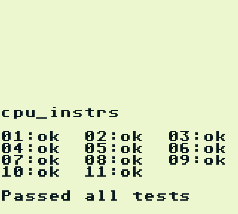
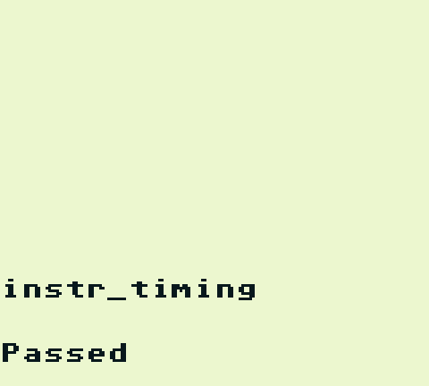
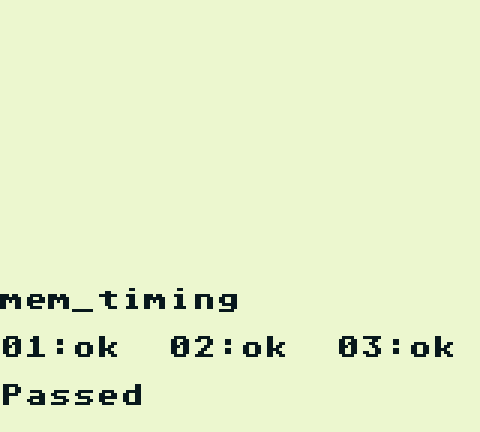
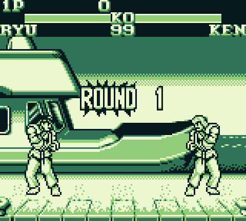

# GameBoy
An original GameBoy emulator in C++ using SDL graphics

## Accuracy

This emulator is *reasonably* accurate; it passes Blargg's timing and CPU tests. It can also run most games I've tested without issues.
I have not implemented hardware bugs such as the HALT behaviour or the OAM bug since I have not yet found a game that relies on these behaviours.

Consider [Sameboy](https://sameboy.github.io/) for accurate hardware emulation.

## Dependencies

- g++ 7.5+
- SDL2 (for graphics and input)

Build using `make`. Optionally build for development using: `make debug`.

I have been able to build and run this project in [WSL](https://docs.microsoft.com/en-us/windows/wsl/install-win10) using [VcXsrv](https://sourceforge.net/projects/vcxsrv/) as an X server for graphics. This solution will still perform well; on my machine this can achieve 40x real time emulation.

## Sound

I have not yet implemented audio emulation, however this project does attempt to emulate the behaviour of the audio registers in order to avoid unexpected behaviour in games that rely on them.

## Controls

The default control mappings are:
| Function | Keyboard mapping |
| ------------- | ------------- |
| A | W |
| B | Q |
| SELECT | Enter |
| START | Space |
| D-PAD | Arrow Keys |
| Toggle Framecap | S |

## Screenshots
|
| ------------- | ------------- |
|

## Useful links

The following links point to documentation that I found useful.
- [Pan Docs](http://bgb.bircd.org/pandocs.htm)
- [GameBoy CPU manual](http://marc.rawer.de/Gameboy/Docs/GBCPUman.pdf)
- [CPU opcode reference](https://rednex.github.io/rgbds/gbz80.7.html)
- [GameBoy opcodes](https://pastraiser.com/cpu/gameboy/gameboy_opcodes.html)
- [Accurate timing information](https://github.com/AntonioND/giibiiadvance/blob/master/docs/TCAGBD.pdf)

